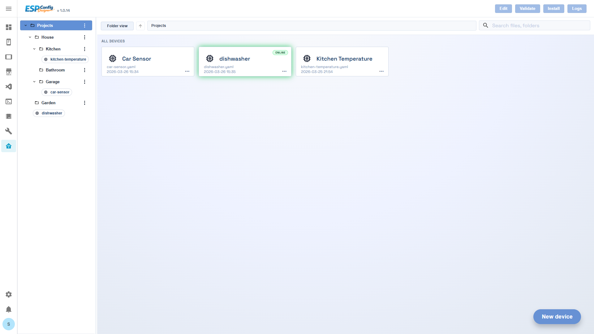
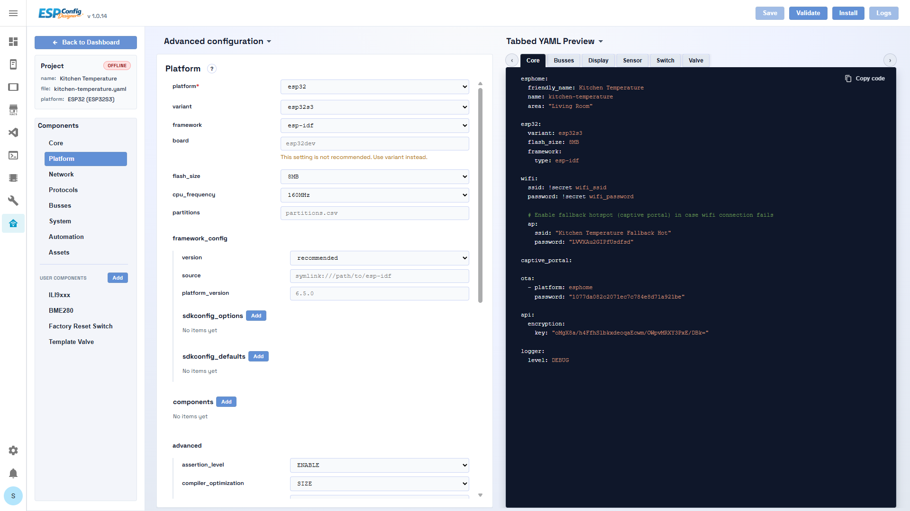
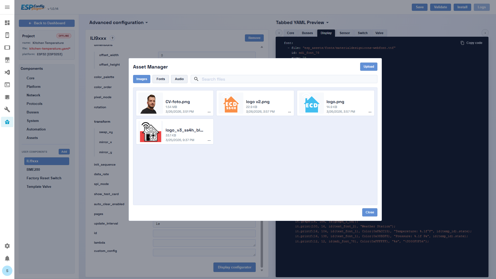

# ESPConfig Designer v.1.3.0

<a href="https://buymeacoffee.com/smartsolutionsforhome" target="_blank">

</a>

ESPConfig Designer is a Home Assistant ingress add-on for building, organizing, validating, compiling, and deploying ESPHome configurations through a schema-driven visual editor.

The repository contains the full add-on:

- `esp-config-designer/` -> backend Home Assistant add-on and API
- `esp-config-designer-frontend/` -> Vue 3 frontend (Dashboard + Builder)

The add-on is designed to let users manage complete ESPHome projects without hand-editing YAML unless they want to.

- [Tutorial](https://youtu.be/CrP15p8e_z8)

---

## Installation Options

ESPConfig Designer can be installed in two supported modes from this same repository.

### Home Assistant OS / Supervised Add-On

Use this option if your Home Assistant installation has the add-on store.

1. Open Home Assistant.
2. Go to Settings -> Add-ons -> Add-on Store.
3. Open the menu in the top-right corner and choose Repositories.
4. Add this repository URL:

   ```text
   https://github.com/sokolsok/ESPConfig-Designer
   ```

5. Find ESPConfig Designer in the add-on store.
6. Install it.
7. Start the add-on.
8. Open the ESPConfig Designer UI from the add-on page or sidebar.

This is the original installation mode. It uses Home Assistant ingress, the existing `esp-config-designer/config.json`, and the existing add-on `esp-config-designer/Dockerfile`. Existing add-on users keep the same update path through Home Assistant.

### Docker Standalone

Use this option if you run Home Assistant Container, or if you want ESPConfig Designer as a separate Docker service outside the Home Assistant add-on system.

Home Assistant Container does not support Home Assistant add-ons. In this setup ESPConfig Designer runs next to Home Assistant as a separate web application, available by default at:

```text
http://<docker-host-ip>:8099
```

The repository includes Docker Compose examples in:

```text
docker/
```

Before using Docker standalone, install Docker and Docker Compose on your system.

Recommended Linux setup uses host networking for the best ESPHome behavior:

```bash
cd docker
cp .env.example .env
docker compose up -d
```

Before starting the container, edit `docker/.env` and change `ECD_AUTH_PASSWORD=change-me`. After startup, open `http://localhost:8099` and log in with username `admin` and the password from `ECD_AUTH_PASSWORD`.

For systems where host networking is not available, use the bridge example:

```bash
docker compose -f compose.bridge.yaml up -d
```

Bridge networking may require manual IP addresses for devices because `.local` mDNS resolution, online/offline status, logs, and OTA can be less reliable without host networking.

### Key Differences

| Area | Home Assistant add-on | Docker standalone |
|---|---|---|
| Install method | Home Assistant add-on store | Docker Compose / Docker image |
| Runtime access | Home Assistant ingress | Direct web app on port `8099` by default |
| Supervisor required | Yes | No |
| Recommended network | Managed by Home Assistant | `network_mode: host` on Linux |
| Default storage | `/config/ecd` | `/config/ecd` inside the container volume |
| Shared ESPHome path | `use_esphome_shared_path=true` -> `/config/esphome` | `ECD_USE_ESPHOME_SHARED_PATH=true` -> `/config/esphome` |
| Updates | Home Assistant update flow | `docker compose pull && docker compose up -d` or optional external updater |
| Authentication | Home Assistant ingress/session | Optional Basic Auth with `ECD_AUTH_MODE=basic` |

Do not expose the Docker standalone service directly to the internet. If you use Docker standalone on a LAN, change the default Basic Auth password in `docker/.env` or protect the service with another trusted access layer.

---

## Relationship With ESPHome

ESPConfig Designer is an independent visual configuration tool for ESPHome. It is not affiliated with, endorsed by, sponsored by, or maintained by the ESPHome project or the Home Assistant project.

The purpose of ESPConfig Designer is to make ESPHome configuration easier to build and maintain through a graphical, schema-driven editor. Generated output is standard ESPHome YAML that can be validated, compiled, and installed using ESPHome tooling.

ESPHome itself is a separate open-source project distributed under its own licenses. Please refer to the official ESPHome repository and documentation for ESPHome licensing, documentation, component behavior, and compatibility details.

The name "ESPHome" is used in this project only to describe compatibility with the ESPHome ecosystem.

---

## What It Does

ESPConfig Designer provides:

- a Dashboard for browsing projects in virtual folders
- a Builder for editing device configuration through JSON schemas
- live YAML preview generated from runtime form state
- a Display Configurator for display-oriented components
- an Asset Manager for images, fonts, and audio
- integrated validate / clean / compile / OTA / logs workflows
- project persistence, secrets editing, and device status tracking

The backend owns storage, files, jobs, and firmware artifacts.
The frontend owns editing UX, schema runtime, preview generation, and install/log orchestration.

---

### Dashboard
Placeholder image should show:

- the left folder tree
- the project cards/grid
- online/offline state badges
- the top action bar



### Builder
Placeholder image should show:

- the Builder tabs
- schema-driven form editing
- YAML preview on the right
- the top action bar (`Save`, `Validate`, `Install`, `Logs`)



### Display Configurator
Placeholder image should show:

- canvas preview
- element inspector / editing panel
- example text/icon/image/shape elements


### Asset Manager
Placeholder image should show:

- modal with Images / Fonts / Audio tabs
- upload / rename / delete controls



---

## Repository Structure

### Root
- `README.md` -> public repository overview

### Backend (`esp-config-designer/`)
- Flask app that serves the API and frontend bundle
- persists project JSON, YAML, assets, devices, jobs, firmware artifacts
- runs ESPHome CLI jobs and exposes logs through streaming endpoints

Important files:

- `esp-config-designer/server.py`
- `esp-config-designer/config.json`
- `esp-config-designer/run.sh`
- `esp-config-designer/Dockerfile`
- `esp-config-designer/web/`

### Frontend (`esp-config-designer-frontend/`)
- Vue 3 + Vite app embedded inside the add-on
- contains:
  - Dashboard
  - Builder
  - Display Configurator
  - Asset Manager
  - shared install/log console flow

Important files:

- `esp-config-designer-frontend/src/App.vue`
- `esp-config-designer-frontend/src/views/DashboardView.vue`
- `esp-config-designer-frontend/src/views/BuilderView.vue`
- `esp-config-designer-frontend/public/components_list/components_list.json`
- `esp-config-designer-frontend/public/schemas/`

---

## Architecture Overview

### Backend responsibilities
- YAML persistence
- project JSON persistence
- virtual folder index persistence
- secrets file access
- component catalog serving and custom component import/delete
- assets API (images, fonts, audio)
- device registry and device status
- ESPHome validate/compile/install/log jobs
- firmware artifact lookup/serving
- static hosting of the built frontend

### Frontend responsibilities
- dashboard explorer and project selection UX
- schema-driven form rendering
- schema loading and extends resolution
- YAML generation for preview/export
- display editor UX
- client-side validation and cross-field warnings
- shared install/log modal orchestration

### Frontend / backend contract
- frontend calls backend over ingress-safe HTTP with `credentials: include`
- frontend persists project state only through backend endpoints
- project JSON stores runtime config, not schema files
- component catalog metadata is the single source of truth for component `schemaPath`

---

## Main User Flows

### Dashboard
- browse projects in virtual folders
- open an existing project in Builder
- create a blank project (`New device`)
- validate / install / logs for the selected project
- customize project tile appearance

### Builder
- edit project configuration from schemas
- preview YAML live
- manage assets
- edit display layouts
- save project and YAML
- validate / compile / OTA / serial flash / logs

### Display workflow
- create text/icon/image/shape/graph/animation elements
- resolve fonts/images/animations into generated YAML assets
- generate display lambda code automatically from layout state

---

## Schema System

The frontend is schema-driven.

### Main schema locations
- general schemas: `esp-config-designer-frontend/public/schemas/general/`
- component schemas: `esp-config-designer-frontend/public/schemas/components/<domain>/<platform>.json`
- component catalog: `esp-config-designer-frontend/public/components_list/components_list.json`
- action picker index: `esp-config-designer-frontend/public/action_list/base_actions.json`
- condition picker index: `esp-config-designer-frontend/public/condition_list/base_conditions.json`

### Core rules
- schemas support `extends`
- visibility uses `dependsOn` / `globalDependsOn`
- YAML emission uses `emitYAML`
- requirements use namespaced IDs, for example:
  - `bus:i2c`
  - `protocol:mqtt`
  - `system:psram`
  - `network:wifi`
  - `component:microphone`
- root singleton components can render as `root_map`
- `embedded` supports list and singleton map emission

Detailed authoring documentation lives in:

- `docs/HOW_TO_CREATE_SCHEMA.md`

## Runtime Storage Model

Base path depends on add-on option `use_esphome_shared_path`:

- `false` -> `/config/ecd`
- `true` -> `/config/esphome`

Derived storage:

- YAML files: `<base>/*.yaml`
- project JSON files: `<base>/esp_projects/*.json`
- folder index: `<base>/esp_projects/projects.json`
- assets:
  - `<base>/esp_assets/fonts/*`
  - `<base>/esp_assets/images/*`
  - `<base>/esp_assets/audio/*`
  - manifest/index JSON files for each asset family

Add-on runtime state:

- jobs: `/data/jobs/*.json` and `/data/jobs/*.log`
- devices: `/data/devices.json`
- ESPHome runtime data: `/data/esphome`

---

## Backend API Summary

### Projects and YAML
- `GET /projects/list`
- `GET /projects/load?name=<project>.json`
- `POST /projects/save`
- `POST /save`
- `GET /yaml/load?name=<node>.yaml`
- `DELETE /yaml/delete?name=<node>.yaml`
- `GET /api/secrets/raw`
- `POST /api/secrets/raw`

### Assets
- `GET /api/assets/manifest?kind=all|images|fonts|audio&refresh=0|1`
- `GET /api/assets/<kind>/<filename>`
- `POST /api/assets/upload?kind=images|fonts|audio`
- `POST /api/assets/rename`
- `DELETE /api/assets/<kind>/<filename>`
- `GET /api/assets/mdi-substitutions`
- `POST /api/assets/refresh?kind=all|fonts|images|audio`

### Devices
- `POST /api/devices/register`
- `DELETE /api/devices/unregister?yaml=<node>.yaml|name=<device_key>`
- `GET /api/devices/list?refresh=0|1`
- `GET /api/devices/status?yaml=<node>.yaml&refresh=0|1`

### Jobs and firmware
- `POST /api/install` (`validate`, `clean`, `compile`, `ota`, `logs`)
- `GET /api/jobs/<job_id>`
- `GET /api/jobs/<job_id>/stream`
- `GET /api/jobs/<job_id>/tail-wait`
- `POST /api/jobs/<job_id>/cancel`
- `GET /api/firmware?yaml=<node>.yaml&variant=factory|ota`

---

## Local Development

### Frontend
From `esp-config-designer-frontend/`:

```bash
npm install
npm run dev
npm run build
```

Optional offline schema mode:

Create `esp-config-designer-frontend/.env.local`:

```bash
VITE_DEV_OFFLINE=1
```

In that mode the frontend reads catalog/schemas from `public/` and skips backend catalog/schema endpoints.

### Backend
The backend is packaged as a Home Assistant add-on. In normal development you edit:

- `esp-config-designer/server.py`
- `esp-config-designer/config.json`
- `esp-config-designer/run.sh`

After backend changes you rebuild/restart the add-on.

### Deploy frontend into add-on
1. build frontend in `esp-config-designer-frontend/`
2. copy `dist/*` into `esp-config-designer/web/`
3. rebuild/restart the add-on

---

## License

ESPConfig Designer is released under the MIT License.

Unless explicitly stated otherwise, the MIT License applies to all files included in this public repository, including the backend, frontend, included free schemas, schema format, and schema authoring documentation.

ESPHome is a separate project and remains governed by its own licenses. ESPConfig Designer does not grant any rights to ESPHome itself, its documentation, trademarks, or third-party dependencies.

---

## Notes For Reviewers / Contributors

- this repository is intentionally schema-driven; many visible UI behaviors come from JSON schema, not hardcoded view logic
- `component_list.json` is the single source of truth for component `schemaPath`
- project JSON stores component IDs and runtime config, not schema paths
- the frontend is split progressively into focused components/composables
