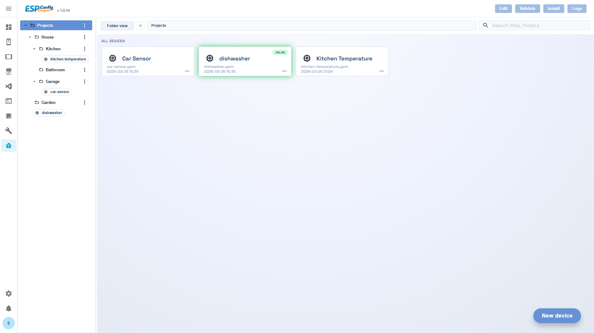
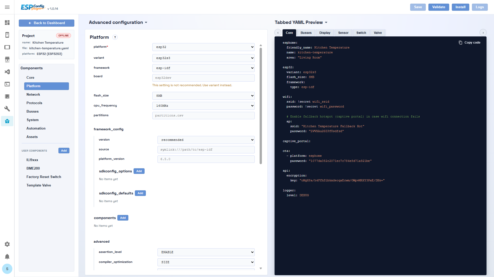
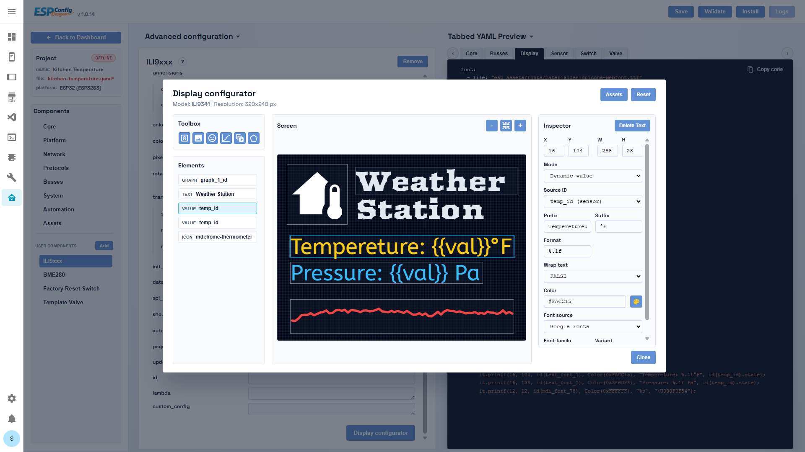
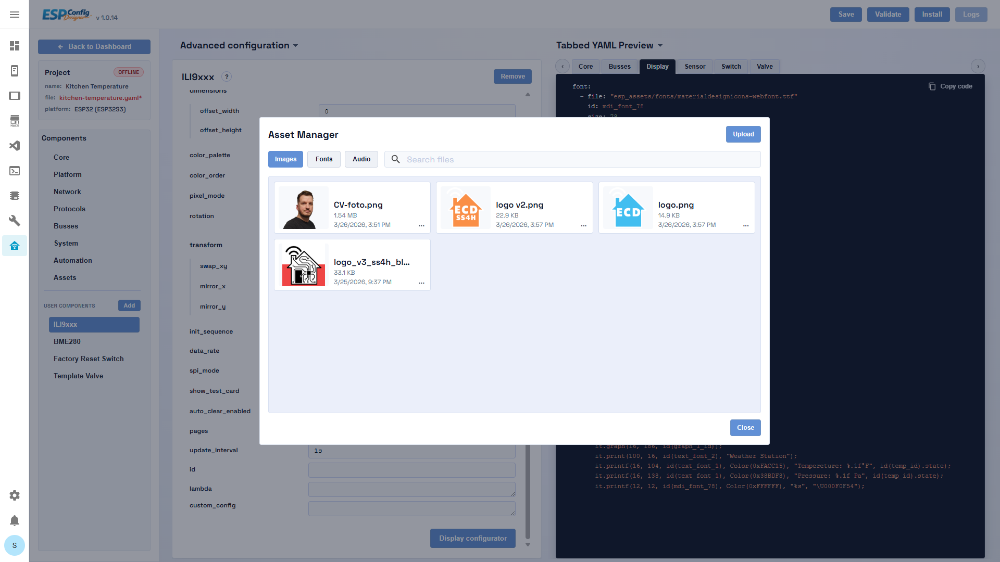

# ESPConfig Designer

<a href="https://buymeacoffee.com/smartsolutionsforhome" target="_blank">

</a>

ESPConfig Designer is a schema-driven visual editor for building, organizing,
validating, compiling, and installing ESPHome configurations. The same Vue
frontend, Flask backend, and schema catalog power three deployment variants:

- a Home Assistant add-on with ingress;
- a standalone Docker service;
- a Windows Desktop application with an unsigned public Windows x64 release.

[Watch the tutorial](https://youtu.be/CrP15p8e_z8).

## Product variants

| Area | Home Assistant add-on | Standalone Docker | Windows Desktop |
|---|---|---|---|
| Status | Supported | Supported; image availability depends on publication | Unsigned public release for Windows 11 x64 |
| Access | Home Assistant ingress | Direct HTTP, port `8099` by default | Local Tauri window and loopback backend |
| Authentication | Home Assistant ingress session | Basic Auth by default or an external trusted layer | Local application |
| Project storage | `/config/ecd` or `/config/esphome` | `/config/ecd` or `/config/esphome` in the bind mount | Local workspace; `%USERPROFILE%\Documents\ecd_workspace` by default |
| Validate, compile, OTA, logs | Yes | Yes | Yes |
| Existing ESPHome storage import | Yes | Yes | No |
| Server-connected serial adapter | Yes | Yes, with the serial Compose override | No |
| Browser-local WebSerial | Yes | Yes | Yes |
| Home Assistant host integration | Yes | No | No |

All variants use the capability contract exposed by the shared backend. The UI
hides unsupported operations, and the backend enforces the same boundaries.

## Quick start

### Home Assistant

Add this repository to the Home Assistant add-on store:

```text
https://github.com/sokolsok/ESPConfig-Designer
```

Install **ESPConfig Designer**, start it, and open its ingress UI. See the
[Home Assistant installation guide](docs/installation/home-assistant.md) for
storage and serial-device details.

### Docker

The default Linux setup uses the common Compose file plus host networking:

```bash
cp docker/.env.example docker/.env
# Change ECD_AUTH_PASSWORD in docker/.env before startup.
docker compose -f docker/compose.yaml -f docker/compose.host.yaml up -d
```

If the configured image tag has not been published, build it locally first as
described in the [Docker installation guide](docs/installation/docker.md). The
guide also covers bridge networking, storage, serial devices, authentication,
updates, and Watchtower.

### Windows Desktop

ESPConfig Designer 1.4.0 is available as an unsigned public release for Windows
11 x64. Windows may display an **Unknown Publisher** warning because the
installer is not Authenticode-signed. Verify the published SHA-256 before
installation.

[Open the Windows 1.4.0 release](https://github.com/sokolsok/ESPConfig-Designer/releases/tag/windows-1.4.0-unsigned.1)
or [download the Windows x64 installer directly](https://github.com/sokolsok/ESPConfig-Designer/releases/download/windows-1.4.0-unsigned.1/ESPConfig-Designer-1.4.0-Windows-x64-setup.exe).

```text
Public availability: YES
Release type: Unsigned public release
Hosted installation and smoke: PASS
Windows 11 clean-machine firmware online/offline/cancel: PASS
Authenticode: NotSigned
```

The exact clean-machine firmware result covers Windows 11 Home 25H2 x64 build
`26200.8973`. Full Windows 10 support is not declared. Windows ARM64 is outside
the release scope. See the [Windows installation guide](docs/installation/windows.md),
the [Desktop development guide](docs/development/desktop.md), and
[Known Issues](KNOWN_ISSUES.md).

## Features

- Dashboard with virtual project folders and device status.
- Schema-driven Builder with live ESPHome YAML preview.
- Display Configurator for display-oriented components.
- Asset Manager for images, fonts, and audio.
- Local YAML import and project persistence.
- Validation, clean, compile, OTA, serial, logs, and firmware workflows where
  supported by the selected runtime.
- Runtime and device diagnostics with bounded, passive network checks.
- Custom component catalogs and schema-driven actions and conditions.

### Dashboard



### Builder



### Display Configurator



### Asset Manager



## Repository layout

```text
esp-config-designer/
  backend/                shared Flask backend
  frontend/               shared Vue 3 and Vite frontend
  shared/schema-catalog/  canonical schemas and catalogs
  CHANGELOG.md            Home Assistant projection of the product changelog
  config.json             Home Assistant add-on metadata
  Dockerfile              Home Assistant add-on image
  Dockerfile.standalone   standalone image
desktop/
  python/                 Desktop runtime adapter
  src-tauri/              Tauri shell and Windows package
docker/                   standalone Compose files
docs/                     installation, development, and authoring
scripts/                  repository contracts and shared gates
VERSION                   canonical product version
CHANGELOG.md              canonical product changelog
```

Generated frontend `dist`, Desktop resources, portable runtime, Cargo `target`,
dependency directories, and local Docker state are not source trees.

The root `CHANGELOG.md` is the only changelog source. After editing it, run
`node scripts/sync-changelog.mjs` to update the tracked Home Assistant projection.
The version contract requires both files to be byte-for-byte identical so the
Supervisor can display release notes without creating a second maintained
changelog.

## Documentation

- [Home Assistant installation](docs/installation/home-assistant.md)
- [Docker installation](docs/installation/docker.md)
- [Windows installation status](docs/installation/windows.md)
- [Desktop development](docs/development/desktop.md)
- [Schema authoring quick guide](docs/HOW_TO_CREATE_SCHEMA.md)
- [Extended schema authoring reference](docs/HOW_TO_CREATE_SCHEMA_EXTENDED.md)
- [Changelog](CHANGELOG.md)

## Security

Do not expose the standalone service directly to the Internet. Change the
default Basic Auth password before using it on a LAN, or put the application
behind another trusted authentication layer.

The public Windows installer is not signed. Windows may identify it as
**Unknown Publisher**. No trusted Authenticode certificate, timestamp,
SmartScreen publisher result, or auto-updater is configured. Windows updates
are manual; verify the SHA-256 published with each installer before running it.

## Relationship with ESPHome and Home Assistant

ESPConfig Designer is an independent visual configuration tool for ESPHome. It
is not affiliated with, endorsed by, sponsored by, or maintained by the ESPHome
or Home Assistant projects. Generated output is standard ESPHome YAML; refer to
the official ESPHome documentation for component behavior and compatibility.

## License

ESPConfig Designer is released under the [MIT License](LICENSE.md). ESPHome,
Home Assistant, and third-party dependencies remain governed by their own
licenses and trademark policies.
